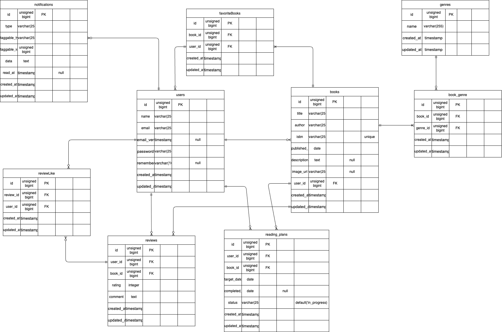

#  📖  time-tracker__test
coachtech模擬案件　書籍管理アプリ
## 概要
### 目的
クライアント（コーチ）とのアプリケーションの設計に関しての詳細を協議しながら、開発を進めることで、実際のアプリケーション開発を擬似的に経験する。
### アプリケーション説明
ユーザーが書籍を登録することで、他のユーザーからの評価を受けることができるBookShelfアプリ。
その他、読書完了までの期日を設定できる読書計画や、ユーザーがどのような書籍を評価しているかのレポート表示、APIを使用した書籍管理などの機能がある。
## 📃laravel環境構築
**🐳Dockerビルド**
1. gitのクローン
```bash
gh repo clone RINGO-days/Bookshelf-app__test
```
2. Dockerデスクトップアプリを立ち上げる
3. ワーキングディレクトリに移動
```bash 
cd bookshelf-app
```
4. Dockerの立ち上げ
```bash
docker-compose up -d --build
```
<details>
<summary style="cursor: pointer;">⚠️ Mac(Apple Silicon)をお使いの方</summary>

>Apple Silicon搭載のMacでは、docker-conpose up -d実行時に以下のエラーが発生することがあります
>### 🚫症状
>`The requested image's platform (linux/amd64) does not match the detected host platform`
>などの警告が出て、作業が終了する場合がある。
>### 💡対策
>docker-compose.ymlを開き、プラットフォームを明示する。
>```text
>mysql:
>        image: mysql:8.0.26
>        platform: linux/amd64　←この行を追加
>        environment:
>        〜
>```

</details>

## 🌲環境構築
**Dockerを立ち上げた後は、以下の手順を順番に実行してください**
### 1. phpコンテナへログイン
```bash
docker-compose exec php bash
```
### 2. ライブラリのインストール
```bash
composer install
```
### 3. 環境設定ファイルの作成
```bash
cp .env.example .env
```
### 4. アプリケーションキーの作成
```bash
sail artisan key:generate
```
### 5. データベースおよび初期データの投入
```bash
sail artisan migrate:fresh --seed
```
### (6.PHPunitでの各アクションの動作テスト )

```bash
sail artisan test --coverage
```
## 🛠使用技術
- Laravel 10.50.3
- PHP 8.5.9
- mysql 8.4
- nginx 1.21.1
- phpMyAdmin
- Fortify
- Sanctum
## 📍開発環境
- http://localhost/books ホーム画面
- http://localhost/register 新規会員登録画面
- http://localhost/login ログイン画面
- http://localhost:8080 phpMyAdmin
## 🔑実装内容
要件シートに則った基本要件の実装
### 📃ER図

### 月次勤怠のCSVファイル出力
管理者画面の指定のスタッフの月次勤怠リストから開いているページの月の勤怠をCSVファイルにて出力
### API
ルート設定はapiResourceを用いて、5エンドポイントを一括定義(index,store,show,update,destroy)。sunctum認証でstore,update,destroyの機能制限をしている。
#### index
- 書籍一覧を取得するアクション
- クエリパラメータによって、出版日、ジャンル、キーワード検索、１ページの表示件数の指定することで取得する書籍を絞り込むことができる。
#### show
- 書籍を取得するアクション
- 書籍IDをしてすることで、指定した書籍の情報を取得できる。
#### store(sunctum認証)
- 書籍を作成するアクション
- bodyデータとして書籍情報を入力し、送信することで、書籍を登録することができる。
#### update(sunctum認証)
- 書籍情報を更新するアクション
- bodyデータに更新する情報を入力し、送信することで、書籍を更新することができる。
#### destroy(sunctum認証)
- 書籍情報を更新するアクション
- 書籍IDを指定することで、書籍を削除することができる。
実装<br>
- app/Policies/AttendanceRecordPolicy.phpを作成し、update,destroyのアクション時に本人または管理者の権限の確認を行う<br>
- Laravel Sanctumを導入しstore,update,destroyのルートにミドルウェアauth:sanctumを適用
### マイ勤怠レポート画面表示機能
当月を基準に半年間の勤怠情報の集計画面の表示<br>
労働時間•残業時間の各合計時間、1日の平均労働時間の表示<br>
半年の期間の各月の勤怠情報<br>
遅刻回数、早退回数、長時間労働回数のカウント
